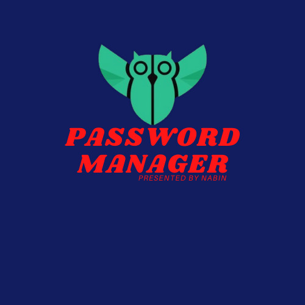

# PASSWORD MANAGER
## INDIVIDUAL PROJECT

Hello, everyone It's me, Nabin Khanal, and I have built this program "password manager" as my semester final coursework.
Using Python Tkinter GUI Tool Kit

## OBJECTIVES:
- To securely save the user's password.
- Users don't need to tense up to memorize Passpord for different websites.
- Allows users to store, generate, and manage their passwords for applications and online services.
- To decrease the trouble of recovery and other password-related issues.

## FEATURES:
- Provides a Login and Signup window. 
- Database to save user details and credentials.
- File handling with update systems.
- Provide shortcuts for some essential websites.
- Generates passwords which can be used on different websites.

## FUTURE GOALS:
- Users will be able to login with their biometric data.
- Try to provide a more user-friendly graphic interface.
- Try to provide this system from a simple desktop window to a website, mobile application and many more.
- Try to provide a notification to the user if his credential is logged in rather than his device.
- Users can be able to manage their passwords as well as their family members.
- Try to provide our software to different organizations for their staff credential management.

 
 
 
 :tada::tada::tada::tada::tada::tada:
        
